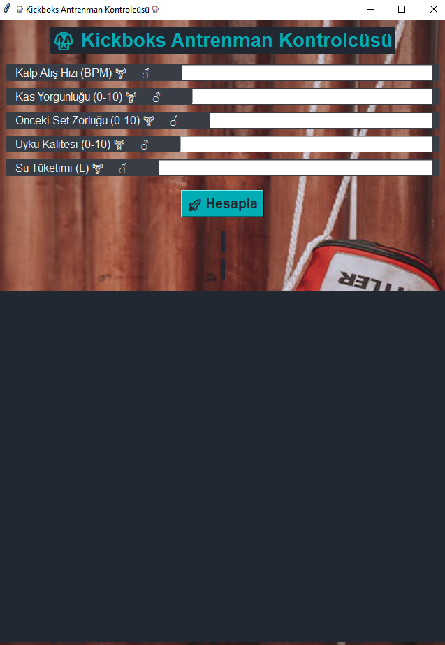
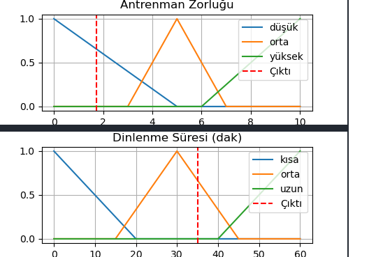

# 🥊 Kickboxing Fuzzy Control System

Kickboxing Fuzzy Control System, kickboks antrenmanlarında kullanıcının kalp atış hızı, kas yorgunluğu, önceki set zorluğu, uyku kalitesi ve su tüketimi gibi parametrelerine dayanarak antrenman zorluğu ve dinlenme süresini bulanık mantık (fuzzy logic) yöntemiyle hesaplayan bir Python uygulamasıdır.

---

## 📋 Proje Özeti

Bu proje, sporcu performansını optimize etmek için bulanık mantık tabanlı bir karar destek sistemi sunar. Kullanıcının girdiği veriler değerlendirilerek, antrenman şiddeti ve dinlenme süresi önerileri kişiye özel şekilde oluşturulur. Tkinter tabanlı arayüzü sayesinde veriler kolayca girilip, sonuçlar grafiklerle görselleştirilir.

---

## 🚀 Özellikler

- Bulanık mantıkla antrenman zorluğu ve dinlenme süresi hesaplama  
- Kalp atış hızı, kas yorgunluğu, önceki set zorluğu, uyku kalitesi ve su tüketimini dikkate alma  
- Sonuçların Matplotlib ile grafik olarak gösterilmesi  
- Kolay kullanılan Tkinter arayüzü  
- Dinamik arka plan resmi  

---

## 🎯 Kullanım

1. Uygulamayı çalıştırın.  
2. Aşağıdaki parametreleri girin:  
    - Kalp Atış Hızı (BPM) [40 - 180]  
    - Kas Yorgunluğu [0 - 10]  
    - Önceki Set Zorluğu [0 - 10]  
    - Uyku Kalitesi [0 - 10]  
    - Su Tüketimi [0 - 4 litre]  
3. "Hesapla" butonuna tıklayın.  
4. Antrenman zorluğu ve dinlenme süresi önerisi ile grafik sonuçları görüntüleyin.

---

## ⚙️ Teknolojiler

- Python 3  
- Tkinter (Grafik arayüz)  
- NumPy (Sayısal hesaplama)  
- scikit-fuzzy (Bulanık mantık)  
- Matplotlib (Grafikler)  
- PIL & Requests (Arka plan resmi)  

---

## 📂 Dosya Yapısı

- `main.py` — Uygulamanın ana dosyası  
- `README.md` — Proje açıklaması  
- `.gitignore` — Git yoksayılan dosyalar  

---
## 🖼️ Görseller

Uygulamanın ekran görüntüleri:

<p align="center">
  
</p>

<p align="center">
  
</p>

## 🔧 Kurulum & Çalıştırma

```bash
git clone https://github.com/kullanici_adi/kickboxing-fuzzy-control.git
cd kickboxing-fuzzy-control
pip install numpy scikit-fuzzy matplotlib pillow requests
python Main.py


